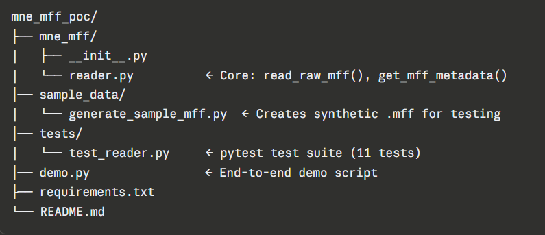
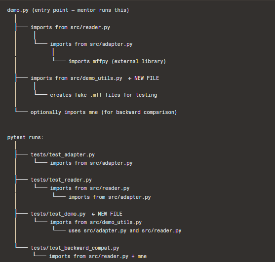
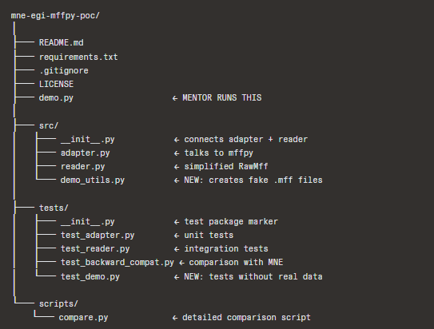

MNE-Python - Proof of Concept

GSoC Project no.3 : Refactoring mne.io.egi to Use mffpy for Reliable EGI-MFF Format Handling

MNE-Python currently reads EGI MFF files using hand-rolled XML and binary parsers.
This PoC shows replacing that with mffpy — a dedicated MFF reader/writer library —
resulting in cleaner code, richer event data, and support for all MFF flavors.
AreaLegacy MNE approachThis PoC (mffpy)XML parsingManual lxml/defusedxml codemffpy.XML.from_file()Binary readnumpy.fromfile + custom offsetsmffpy.get_physical_samples_from_epoch()EventsSimple array, loses label/durationFull event track with label, code, durationMFF flavorsContinuous only (well supported)Continuous, Segmented, AveragedUnitsManual µV → V conversionmffpy returns physical units

Project structure: 

Here is how the file is connected with eachother: 

Updated file structure : 

Setup
Activate your venv first
venv\Scripts\activate

# Install dependencies: 

pip install mne mffpy numpy scipy pytest

Run the demo: 

python demo.py

Run the tests: 

pytest tests/ -v

